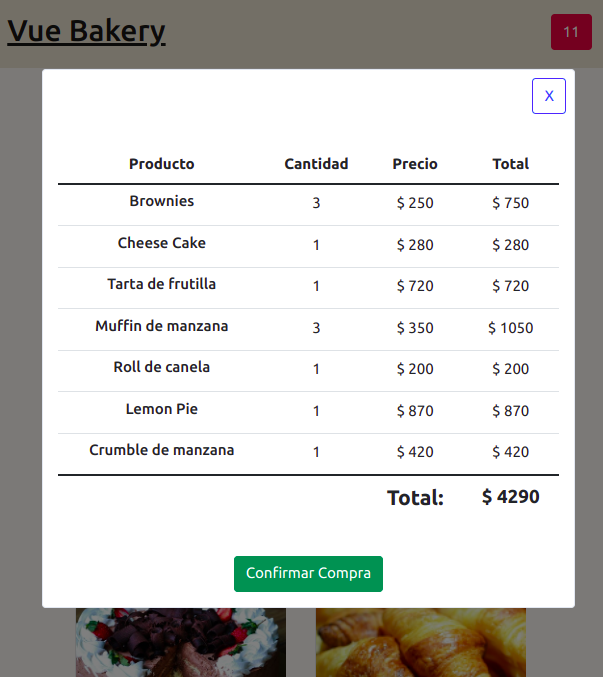
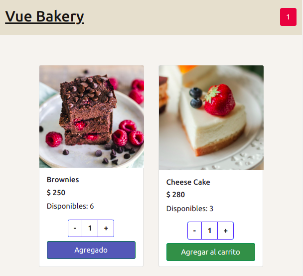

# Curso Vue.js
## Tutor: David Leda
### Primera Entrega del Proyecto Final

<br>

__1.__ Por favor hagan la entrega en un link a un repositorio de GitHub, __no en una archivo ZIP__.

__2.__ Para los estilos pueden usar la librería que quieran: Tailwind, BootstrapVue, Bulma, o sus propias clases de CSS.

__3.__ No es necesario que hagan los componentes de Login y SignUp. No tiene sentido hacerlos en este punto porque aún no vimos Vue Router.

__4.__ Para mostrar la información de productos pueden crear un componente que use [cards](https://getbootstrap.com/docs/4.0/components/card/) de Bootstrap. Recuerden agregar un par de clases de CSS para el tamaño de la card:

```css
.card-size {
  width: 14rem;
  height: 27rem;
}

.card-image {
  width: 14rem;
  height: 14rem;
  object-fit: cover;
}
```
Luego, en el componente padre (App.vue) pueden iterar sobre el array de productos con un `v-for`:

```html
<product-card
  v-for="product in products"
  :key="product.id" 
  :product="product"
  @add-to-cart="updateCart"
/>
```

__5.__ Para el componente del carrito pueden usar una ventana modal que se abra al cliquear en el contador de productos:



Para poder usar una modal de Bootstrap en Vue tienen que instalar [BootstrapVue](https://bootstrap-vue.org/docs/components/modal) o alguna librería para ventanas modales (yo usé [VueFinalModal](https://vue-final-modal.org/)).

Si usan BootstrapVue primero tienen que registrar el plugin en `main.js`:

```js
import Vue from 'vue'
import App from './App.vue'
import { BootstrapVue } from 'bootstrap-vue'

import 'bootstrap/dist/css/bootstrap.css'
import 'bootstrap-vue/dist/bootstrap-vue.css'

Vue.use(BootstrapVue)

new Vue({
  render: h => h(App),
}).$mount('#app')
```

Luego pueden crear un componente para la modal, y dentro de éste un componente hijo para la tabla de productos. Para la tabla pueden reutilizar el componente que hicimos en la entrega anterior (TableComponent.vue). Y a la tabla le pasan como `prop` el array de productos en el carrito (`cart`). Recuerden primero pasar el array del carrito como `prop` desde el componente padre (App.vue) al componente de la modal (CartModal.vue) ya que las `props` no se pueden pasar de abuelo a nieto, solo de padre a hijo:

```html
<template>
  <b-modal id="modal-1" title="Carrito">
    <table-component :cart="cart"/>
  </b-modal>
</template>
```

__6.__ La consigna dice que los datos de productos pueden estar en un archivo JSON o dentro de los componentes. Les recomiendo que no la pongan dentro del componente de productos (ProductCard.vue) sino en el componente padre (App.vue) ya que esa información puede ser requerida por otros componentes (por ejemplo, el del carrito) por lo que es mejor centralizar toda la información en el padre.

Si pueden, sería mejor que usen un archivo JSON en lugar de tener toda la información de productos hardcodeada en el objetdo `data` para que el `<script>` de App.vue no les quede tan largo, y también para simular una llamada a una API, que es la forma más usual en que se obtiene este tipo de información en una app de Vue. Para simular la llamada a la API pueden usar una librería de llamadas HTTP como [Axios](https://www.npmjs.com/package/axios). Para usarla primero deben instalarla (`npm i axios`) y luego importarla en el `<script>` de App.vue:

```js
import axios from 'axios'
import NavBar from '@/components/NavBar.vue'
import ProductCard from '@/components/products/ProductCard.vue'

export default {
  name: 'App',
  components: {
    NavBar, ProductCard
  },
  data: () => ({
    products: [],
    cart: []
  }),
  mounted() {
    this.getProducts()
  },
  methods: {
    async getProducts() {
      try {      
        const res = await axios.get('./data/products.json')
        // Guardar la data en el array products declarado más arriba:
        this.products = await res.data
      } catch (err) { console.log (err) }
    }
  }
}
```
Si lo hacen así, recuerden poner el archivo JSON dentro de la carpeta `public`, no en la carpeta `src`.


__7.__ Les recomiendo que declaren el array del carrito en el objeto `data` de App.vue, no en el componente de la tabla. Esto es para centralizar la información en el componente padre y luego pasarla como `props` a sus hijos, ya que más adelante pueden necesitar esa información en otro componente que no sea la tabla y se les va a complicar pasarla de un componente al otro.

```js
data: () => ({
  products: [],
  cart: []
}),
```

__8.__ Para agregar productos al carrito deben pasarle el id del producto del hijo (ProductCard.vue) al padre (App.vue). Para esto deben usar un `$emit` que se ejecute al cliquear en el botón de agregar al carrito:

```html
<button 
  class="btn btn-success"
  @click="addToCart"
>Agregar al carrito</button>
```

```js
addToCart() {
  this.$emit('add-to-cart', this.product.id)
}

```
Este evento `$emit` debe ser recibido en el componente padre (`@add-to-cart="updateCart"`):

```html
<product-card
  v-for="product in products"
  :key="product.id" 
  :product="product"
  @add-to-cart="updateCart"
/>
```
Y al ser recibido ejecuta un método en el padre (App.vue):

```js
updateCart(productId) {

  const productInCart = this.cart.find(product => product.id === productId)
      
        
  if (productInCart) {
    // Si el producto ya esta en el carrito solamente cambio la cantidad y el precio total para ese producto:
    productInCart.quantity++;
    productInCart.total = productInCart.quantity * productInCart.price;
        
  } else {
    // Si el producto no esta en el carrito, lo agrego.  
    // Para no mutar propiedades del array de productos original
    // busco el producto y lo guardo en un nuevo objeto
    const newProduct = this.products.find(product => product.id === productId);
  
    this.cart.push({
      ...newProduct,
      quantity: 1, 
      total: newProduct.price
    })
  }
} 
```
__9.__ Para modificar la cantidad de productos pueden crear un componente contador (como el que hicimos en la primera entrega) que esté dentro del componente ProductCard. No es obligatorio hacerlo así, pero queda más claro para el usuario poder ver cuántos productos ya tiene agregados:



__10.__ Traten de repartir los componentes en subcarpetas (productos, carrito) para que el proyecto quede más organizado. Les paso la estructura que usé yo (no es necesario que lo hagan igual):

```
.
├── babel.config.js
├── jsconfig.json
├── package.json
├── public
│   ├── data
│   │   └── products.json
│   ├── favicon.ico
│   └── index.html
├── src
│   ├── App.vue
│   ├── assets
│   │   └── logo.png
│   ├── components
│   │   ├── cart
│   │   │   ├── CartModal.vue
│   │   │   └── TableComponent.vue
│   │   ├── NavBar.vue
│   │   └── products
│   │       ├── ProductCard.vue
│   │       └── ProductCounter.vue
│   └── main.js
├── vue.config.js
└── package-lock.json
```