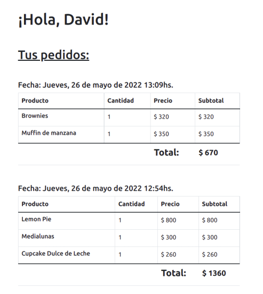

# Curso Vue.js
## Tutor: David Leda
### Segunda Entrega del Proyecto Final

<br>

Sin duda, la consigna de esta entrega es demasiado apresurada para un curso que empezó hace poco más de un mes. En mi opinión el curso debería durar al menos 2 meses maś y así poder ver cada tema con más detenimiento. Según Evan You, el creador de Vue, aprender Vue no debería tomar más de 3 años (pero no 2 meses):


__1.__ Aunque éste no es un curso Full Stack, es importante que entiendan cómo funciona la interacción entre Frontend y Backend:

Al trabajar en un entorno de desarrollo como estamos haciendo ahora, lo que vemos en el browser es sólo __una__ instancia del Frontend: la que es servida por Webpack (el servidor de desarrollo que usa Vue 2) en la dirección `localhost`.

Pero una vez que la app está online las instancias del Frontend son múltiples, una por cada usuario que accede al sitio desde su dispositivo, mientras que el Backend es único y no es visible para el usuario (más allá de que pueda estar dividido en containers o microservicios). De esta forma la información que maneja la app está centralizada en el Backend y es independiente del Frontend. Y a su vez esto permite controlar qué usuarios pueden acceder a cierta información (autenticándose con un Login) y qué usuarios pueden modificarla (los que sean Admins). 

Si la información de Login estuviese alojada en el Frontend las web apps serían fácilmente hackeables. Por esa razón, la autenticación de usuarios sólo es posible usando un Backend (o un [BaaS](https://es.wikipedia.org/wiki/Backend_as_a_service) como [Firebase](https://firebase.google.com/)).

__2. MockApi:__ Primero deben crearse una cuenta en [MockApi](https://mockapi.io/). Luego de crear la cuenta deben crear 3 resources: uno para productos, otro para usuarios y otro para pedidos (o carritos). Los tres campos que dicen Faker.js bórrenlos y dejen solo el campo del id (es para que MockApi genere un id en forma automática cada vez que se agrega un nuevo item):


Luego, en el resource de productos, en la sección `data`, agreguen un array de objetos JSON (o sea, con comillas en las keys) con sus productos.

__3. Vincular Resources:__ Este punto es opcional, ya que la consigna no es muy clara al respecto (solo dice "*Crear un último recurso que será el carrito, integrando GET y POST para realizar y revisar pedidos.*") pero les recomiendo que lo hagan de esta forma, ya que no tendría sentido mostrarle a cada usuario que usa la app los pedidos que hicieron todos los demás usuarios. Lo más lógico sería mostrarle al usuario que está loggeado los pedidos (o carritos) que tiene este usuario y no otros.

Como el plan gratuito de MockApi permite crear una sola vinculación entre resources creo que es más útil usar la de pedidos (orders) en vez de la de carritos ya que la información de carritos es efímera (se borra cuando la compra es confirmada) mientras que el historial de pedidos debería tener persistencia en el Backend.

En teoría se podría encontrar la forma de tener un sólo resource para ambos con una propiedad adicional en cada objeto del array del carrito. Por ejemplo, agregándole la propiedad `compraConfirmada: false` y al concluir la compra cambiarla a `true`. Luego filtrar el array según el valor de esta propiedad y pasarle por `props` a la vista de pedidos únicamente los que retornan `true`.

En mi opinión no vale la pena complicarse con esto ya que en una app real no tendrían las limitaciones que tienen con MockApi (por ejemplo, al usar un Backend creado con Node.js y MongoDB) y fácilmente se podría crear un recurso adicional para los carritos y vincularlos al id del usuario. Si quieren darle persistencia a los carritos mejor usen `localStorage`...

Para vincular dos resources en MockApi deben arrastrar con el mouse el de orders al de users. Debería quedarles algo así:


Al vincular orders con users la URL para orders les va a quedar encapsulada dentro de users, y así pueden obtener los pedidos que hizo un usuario en particular:

```js
getOrders: async (userId) => {
  try {
    const { data } = await axios.get(`${apiUrl}/users/${userId}/orders`);
    return data;
  
  } catch (err) { console.log (err) }
}
```
Para guardar nuevos pedidos con `axios.post` deben usar la misma ruta. 

Al crear el resource de pedidos pueden dejar el campo `createdAt` usando Faker.js pero recuerden que [Faker](https://fakerjs.dev/api/date.html#recent) genera datos al azar, no la fecha exacta. 


__4. Local Storage:__ Para guardar el carrito en `localStorage` pueden hacerlo así:

```js
localStorage.setItem('cart', JSON.stringify(this.cart));
```
Y crear un método para recuperar el carrito de `localStorage` en el inicio:

```js
mounted() {
  this.getProducts();
  this.getCart();
},

methods: {

getCart() {
  this.cart = JSON.parse(localStorage.getItem('cart')) || [];
},

// etc...
}

```
Y luego de confirmada la compra, borrarlo:

```js
localStorage.removeItem('cart');
```

__5. Axios:__ Para las peticiones HTTP es más simple usar [Axios](https://www.npmjs.com/package/axios) que el método nativo `fetch`. 


Ya que estos métodos no utilizan el objeto `this` de Vue no es necesario crear un `mixin` con `methods` para esto, con un objeto de JavaScript que los contenga es suficiente.

Este objeto puede estar en un archivo `.js` (no en un archivo `.vue`) y luego ser importado en cada componente que los necesite. De esta forma evitan tener que volver a importar Axios en cada componente, y repetir tanto código dentro de los `methods` (o de las `actions` de Vuex, más adelante). 

Este archivo pueden ponerlo en `src` dentro de una carpeta llamada `services` (así es cómo suele llamarse a los métodos de acceso a APIs). Luego pueden exportar el objeto (`apiServices`) con un `export default`.

Si quieren, en vez de un objeto pueden crear una `class` para los services. El uso de clases de JavaScript es (o era) una práctica bastante usual para crear métodos de servicios, pero en mi opinión (y la de gente más experimentada que yo) la creación de Singletons (clases de una sola instancia) en JavaScript [no es una buena práctica](https://medium.com/giant-machines/stop-using-javascript-classes-d0b6890ef097).

```js
// src/services/api.services.js

import axios from 'axios';

const apiUrl = process.env.VUE_APP_API_URL

const apiServices = {

  getProducts: async () => {
    try {
      const { data } = await axios.get(apiUrl + '/products');
      return data;
    
    } catch (err) { console.log (err) }
  },

  saveProduct: async (product) => {
    try {
      const { data } = await axios.post(apiUrl + '/products', product);
      return data;

    } catch (err) { console.log (err) }
  },

  // etc...
}

export default apiServices
```

Luego, para importar este objeto dentro del componente, al comienzo del `<script>` ponen:

```js
import apiServices from '@/services/api.services';
```

Y para usar los métodos del objeto, siempre ponerlos dentro de `methods` asincrónicos:

```js
methods: {
  
  async getProducts() {
    this.products = await apiServices.getProducts();
  },
  // etc...
}

```


__6. Variables Env:__ No es obligatorio que usen una variable de entorno (`VUE_APP_API_URL`) para guardar la URL de su cuenta de MockApi. Si quieren pueden ponerla directamente en una `const`:

```js
const apiUrl = 'https://627db8bcb75a25d3f3aab8d1.mockapi.io/api';
```
Sin embargo, les recomiendo que se acostumbren a usar variables de entorno porque es la práctica más usual para guardar la URL o la key de una API en Vue. Esto es para evitar que esta información quede expuesta al subir el repositorio a GitHub.

Para crear la variable de entorno deben crear un archivo `.env` en la raíz del proyecto (o sea, donde está `package.json`, no en `src`) y declarar la variable dentro de ese archivo:

```
VUE_APP_API_URL=https://627db8bcb75a25d3f3aab8d1.mockapi.io/api
```
No olviden agregar `.env` a la lista de su `.gitignore` para que este archivo no se incluya en los commits a GH.

__7. Router:__ Como todavía no estamos usando Vuex es conveniente que centralicen toda la data global (products, cart, user) en App.vue, y que los demás componentes accedan o modifiquen esta data mediante `props` y `emits`.

Pero no es necesario que importen todos los componentes dentro de App.vue, pueden importar únicamente la NavBar y el resto de los componentes se va a renderizar dentro de `<router-view>` según la ruta a la que acceda el usuario:

```html
<template>
  <div>

    <nav-bar 
      :cart="cart"
      @confirm-order="confirmOrder"
      @logged-in="login"
    />

    <router-view 
      :products="products"
      :cart="cart"
      :user="user"
      @add-to-cart="updateCart"
    />

  </div>
</template>

<script>
```
```js
import apiServices from '@/services/api.services';
import NavBar from '@/components/NavBar.vue'

export default {
  name: 'App',

  components: {
    NavBar
  },

  data: () => ({
    products: [],
    cart: [],
    user: null
  }),

  mounted() {
    this.getProducts();
    this.getCart();
  },

  methods: {
    async getProducts() {
      this.products = await apiServices.getProducts();
    },
    getCart() {
      this.cart = JSON.parse(localStorage.getItem('cart')) || [];
    }, 
    // etc...
  }
}

```
__8. Router:__ Para que las `views` puedan recibir `props` a través de `<router-view>` deben setearlas en `true` en el archivo del router. Si el componente tiene declaradas esas `props`, las va a tomar, y si no las tiene declaradas, no hace nada.

```js
// src/router/index.js
import Vue from 'vue'
import VueRouter from 'vue-router'
import HomeView from '@/views/HomeView.vue'

Vue.use(VueRouter)

const routes = [
  {
    path: '/',
    name: 'home',
    component: HomeView,
    props: true
  },
  {
    path: '/admin',
    name: 'admin',
    component: () => import('@/views/admin/AdminView.vue'),
    props: true
  },
  // etc...
]
```
Y luego direccionar a la ruta con `<router-link>`:

```html
<router-link 
  v-if="user"
  :to="user.isAdmin ? '/admin' : '/client'"
>{{ user.isAdmin ? 'Admin' : 'Mi Cuenta' }}</router-link>
```
Y dentro del componente, declarar las `props` que necesita:

```js
export default {
  name: 'AdminView',

  props: {
    user: {
      type: Object
    }
  },

  // etc...
}
```
Para determinar qué usuario es Admin (`user.isAdmin`) recomiendo que lo hagan directamente modificando la propiedad `isAdmin` en el resource de usuarios de MockApi, no dándole esta opción al usuario en el formulario con un `checkbox`, sino cualquier usuario podría ser Admin.

__9. Router:__ La vista de Admin y la vista del cliente sólo deberían ser visibles para el Admin o el cliente. Si por ejemplo un usuario que no es Admin ingresa en su browser la URL de la vista de Admin esta no debería mostrarse, sino que debería redireccionar a la vista principal (HomeView). Y lo mismo para la vista con los pedidos del cliente, si un usuario no loggeado intenta entrar a esa vista, debería ser redireccionado a HomeView:

```js
import apiServices from '@/services/api.services';

export default {
  name: 'AdminView',
  
  data: () => ({
    products: []
  }),

  props: {
    user: {
      type: Object
    }
  },

  mounted() {
    this.getProducts();
  },
  
  methods: {

    // Si no hay un usuario admin loggeado, volver a home
    async getProducts() {
      if (this.user) this.products = await apiServices.getProducts();
      else this.$router.push('/')
    }
  }
}
```


__10. Router:__ Al recibir el array de productos en `<router-view>` mediante props, pueden poner el componente de las cards (ProductCard.vue) dentro de la vista principal (HomeView.vue) y declarar esas `props` que van a recibir:

```js
import ProductCard from '@/components/products/ProductCard.vue'

export default {
  name: 'HomeView',

  components: {
    ProductCard
  },

  props: {
    products: {
      type: Array,
      required: true
    },
  },

  // etc...
}
```

__11. Rutas Dinámicas:__ Para las rutas dinámicas (es decir, las que generan una URL distinta según los `params` que se le pasen) deben usar `<router-link>` de esta forma:

```js
<router-link 
  :to="{ 
    name: 'update', 
    params: { 
      id: product.id,
      product 
    } 
  }" 
  class="btn btn-success"
>Actualizar</router-link>
```
El primer `param` (en este caso el `id`) es el que determina el nombre de la URL. Por ejemplo, `http://localhost:8080/admin/update/1` en donde 1 es el `id` del producto que se le pasó por `param`. 

El segundo param (`product`) son los datos del producto, que luego pueden ser renderizados en el formulario para Actualizar (Update) y así no tener que volver a cargar en el formulario dato por dato cuando solo queremos actualizar un único dato del producto (el stock, por ejemplo). 

Luego en la view (UpdateProduct) reciben esos dos `params` como `props`:

```js
export default {
  name: 'UpdateProduct',

  props: {
    id: {
      type: String,
      required: true
    },
    product: {
      type: Object
    }
  },
  // etc...
}
```

Para la vista de Agregar Producto pueden reutilizar la vista de Actualizar o crear otra vista aparte.

Para el link a la vista de Agregar, en vez de pasarle el `id` del producto (que aún no tienen porque es un producto que aún no fue cargado en la lista) le pueden pasar como primer `param` directamente el nombre de la ruta, por ejemplo, `agregar` o `add-product`, y como segundo `param` un objeto vacío (`product: {}`), ya que al agregar un nuevo producto deben cargar todos los campos del formulario de cero:

```js
<router-link
  :to="{
    name: 'update',
    params: {
      id: 'agregar',
      product: {}
    }
  }" 
  class="btn btn-primary"
>+ Agregar Producto</router-link>
```


__12. UpdateView:__ Otra opción: en lugar de pasarle por `params` los datos del producto a la vista de Update se puede pasarle por `params` únicamente el `id` del producto y luego obtener los datos del producto directamente de la API por el `id` de la ruta (`this.$route.params.id`):

```js
import apiServices from '@/services/api.services';

export default {
  name: 'UpdateProduct',

  data () {
    return {
      product: {
        name: '',
        price: '',
        stock: '',
        image: ''
      },
      id: this.$route.params.id
    }
  },

  created() {
    this.getProductById();
  },

  methods: {

    async getProductById() {
      // Si la ruta se llama 'agregar' los datos del producto quedan en blanco
      // de lo contrario, obtiene de la API el producto por su ID:
      if (this.id != 'agregar') {
        this.product = await apiServices.getProductById(this.id)
      }
    },
    // etc...
  }
  // etc...
}
```


__13. Login:__ Para el Login pueden usar una ventana modal o una `view`, como prefieran. Pero recuerden que como aún no estamos usando Vuex deben hacer un `emit` con la data del usuario una vez que el Login fue realizado, para modificar el estado global de la app indicando que hay un usuario loggeado.

Para autenticar al usuario pueden usar nombre y password, o email y password, como prefieran (en mi caso usé nombre y password):

```js
import apiServices from '@/services/api.services';

export default {

  data: () => ({
    username: '',
    password: '',
    alert: ''
  }),
  
  methods: {

    async login() {
      const users = await apiServices.getUsers();
      const user = users.find(user => user.username === this.username && user.password === this.password)

      if (user) {
        this.$emit('logged-in', user);
      } else {
        this.alert = 'Usuario o contraseña incorrectos.';
      }
    }
  },
  // etc...
}
```
El objeto del usuario que envíen a App.vue con el emit (`this.$emit('logged-in', user);`) contiene el ID del usuario que luego les va a servir para obtener los pedidos del usuario por su ID.

Tengan en cuenta que esta es una versión simplificada de un Login real. En una app real deberían generar una sesión de usuario, ya sea con [Cookies](https://medium.com/developer-rants/session-cookies-between-express-js-and-vue-js-with-axios-98a10274fae7) o con [JWT](https://blog.logrocket.com/how-to-implement-jwt-authentication-vue-nodejs/) y validar la Cookie (o el token) en cada petición HTTP.

__14. Login:__ Como esta app es un e-commerce no es conveniente que la vista de Login bloquee la vista principal (HomeView) como ocurriría en el caso de una red social o la app de un banco, en donde el usuario no puede ver nada si no hizo previamente un Login. En un e-commerce lo primero que el usuario debe ver son los productos, no un Login. El Login debería accederse mediante un botón en la NavBar. 

__15. Signup:__ Para el Signup pueden usar una ventana modal o una `view`, como prefieran. En el formulario recuerden usar las validaciones que vimos en el entregable anterior:

```js
validateEmail() {
  const mailRegExp = /^\w+([.-]?\w+)*@\w+([.-]?\w+)*(\.\w{2,3})+$/;
  this.alert.email = mailRegExp.test(this.form.email) ? 
    '' : 
    'Formato de email inválido.';
  if (!this.form.email) this.alert.email = '';
}
```

También es conveniente validar que no existan usuarios registrados con el mismo nombre o el mismo email:

```js
const users = await apiServices.getUsers();
const userName = users.find(user => user.username === this.form.username);
const userEmail = users.find(user => user.email === this.form.email);

if (userName) {
  this.alert.username = 'Ya existe un usuario con ese nombre.';

} else if (userEmail) {  
  this.alert.email = 'Ya existe un usuario con ese email.';
}
```

Luego deben enviar la data del formulario a MockApi y redireccionar al usuario a la vista de Login, o a la vista principal para que vaya de ahí al Login. En este caso no es necesario hacer un `emit` con la data del usuario (en el caso del Login sí), sólo un POST a la API:

```js
await apiServices.createUser(this.form);
this.$router.push('/');
```

__16. AdminView:__ Para crear la vista de Admin pueden usar una tabla que muestre el listado de productos obtenidos de la API y botones para actualizar o eliminar cada producto:


Estos botones deberían disparar peticiones PUT (actualizar) o DELETE a la API, según el ID del producto:

```js
deleteProduct: async (productId) => {
  try {
    const res = await axios.delete(`${apiUrl}/products/${productId}`);
    return res.data;
  
  } catch (err) { console.log (err) }
},
```

Este cambio debería verse reflejado en el listado de productos de AdminView.

__17. AdminView:__ Para agregar un nuevo producto pueden crear una nueva view con un formulario:


El botón debería disparar una petición POST a la API con los datos del nuevo producto.

Para el formulario de actualización (PUT) pueden reutilizar el mismo componente y cambiar el texto en el botón ('Actualizar producto' en vez de 'Agregar producto') y el método que dispara el botón (`axios.put` en vez de `axios.post`).

__18. Imágenes:__ Nuevamente les recomiendo que para las imágenes de productos usen un servidor de imágenes externo, de lo contrario no van a poder agregar imágenes usando el formulario.

Aunque sería posible poner en el campo de la URL de la imagen el path de la carpeta `assets` (por ejemplo: `@/assets/images/imagen-producto.jpg`) eso es porque la app está en modo desarrollo, con un servidor local, y pueden agregar nuevas imágenes a esta carpeta fácilmente. Pero si la app está online no pueden hacer esto. Tendrían que agregar la imagen al repositorio, hacer un nuevo commit, luego un nuevo build y luego un nuevo deploy. Por eso recomiendo que suban las imágenes a Imgur.com y luego copien y peguen la URL de Imgur en el formulario. 

Otra opción, mucho más compleja que Imgur pero muy utilizada en Vue, es usar [Cloudinary](https://cloudinary.com/documentation/vue_integration). Con Cloudinary no necesitan copiar y pegar la URL de la imagen en el formulario. Pueden subir directamente el archivo de la imagen desde la app de Vue y el archivo se guarda en el servidor de Cloudinary. Luego la API de Cloudinary retorna la URL de la imagen subida y esa URL se guarda en la base de datos que estén usando.

__19. ClientView:__ Este punto es opcional ya que la consigna no es muy clara al respecto (solo dice: *listado de productos y carrito*).

Si quieren mostrarle al usuario el listado de pedidos que realizó pueden hacerlo obteniéndolos de la API como en el punto 3 acá arriba (`getOrders`) y luego mostrándolos en una tabla ordenados por fecha:




__20. Estructura del proyecto:__ Les recomiendo que ordenen las views y los componentes en distintas carpetas según corresponda. Esta es la estructura que usé yo (no es necesario que lo hagan igual):

```
.
├── babel.config.js
├── jsconfig.json
├── package.json
├── public
│   ├── favicon.ico
│   └── index.html
├── README.md
├── src
│   ├── App.vue
│   ├── assets
│   │   └── logo.png
│   ├── components
│   │   ├── cart
│   │   │   ├── CartModal.vue
│   │   │   └── CartTable.vue
│   │   ├── NavBar.vue
│   │   ├── products
│   │   │   ├── ProductCard.vue
│   │   │   └── ProductCounter.vue
│   │   └── user
│   │       └── LoginModal.vue
│   ├── main.js
│   ├── router
│   │   └── index.js
│   ├── services
│   │   └── api.services.js
│   └── views
│       ├── AboutView.vue
│       ├── admin
│       │   ├── AdminView.vue
│       │   └── UpdateProduct.vue
│       ├── HomeView.vue
│       ├── products
│       │   └── ProductView.vue
│       └── user
│           ├── ClientView.vue
│           └── SignupView.vue
├── vue.config.js
└── yarn.lock
```
